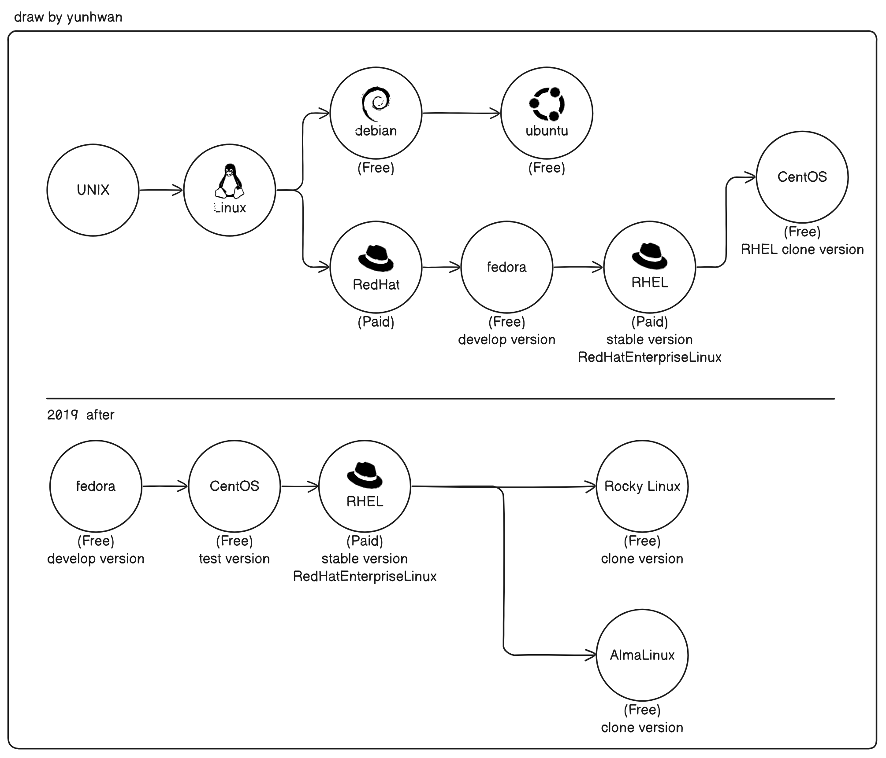

# 컨테이너 한방 정리
    1. OS 소프트웨어의 흐름
    2. 컨테이너 기술의 흐름

## 1. OS 소프트웨어의 흐름
> [OS 흐름 그림 요약]
>  

최초 OS인 UNIX가 있었는데 유료였음  
누가 이 `UNIX`를 기반으로 OS를 설계해서 `Linux`를 만듬,
이 `Linux`는 무료여서 여러 회사에서 사용하게 됨  
이 `Linux` 를 기반으로 여러 배포판이 나오는 데 크게 2가지로 나뉨  
1. 무료 버전인 `Debian` 계열
   - `ubuntu` : `debian`기반 배포판 OS `debian`에 비해 사용자 편의기능이 더 많음, 세계적으로 많이 사용됨
2. 유료 버전인 `RedHat` 계열  
   1.  `fedora` : `RedHat`에소 새로운 기능을 개발하여 적용한 버전, 무료
   2. `RHEL` : RedHatEnterpriseLinux의 약자로, `fedora`에서 개발한게 안정화되어 릴리즈한 버전
   3. `CentOS` : `RHEL`을 복사해서 만든 배포판, 무료
- 2019 RedHat이 IBM에 인수된 후, 
  1. `fedora` :  새기능 개발, 무료 
  2. `CentOS Stream` : `fedora`의 테스트 배포판으로 사용, 무료
  3. `RHEL` : `CentOS Stream`에서 안정화가 되면 `RHEL`로 릴리즈
  4. `Rocky Linux`, `AlmaLinux` : 위의 `RHEL`을 복제한 
 
근데 보통 기업들은 보안과 안정성, 최신기술 등의 이유로 os를 꾸준히 업데이트하는데  
버그나 문제가 생기면 이를 해결해야함, 그러나 큰 기업이 아닌 이상 관리하기 힘듬  

그래서 이를 관리해주는 Redhat 유료 버전으로 많이 사용함.  

---
    요약
    1. 리눅스는 크게 2계열 debian, redhat
    2. 쿠버네티스도 2계열로 지원.
    3. 쿠버네티스 설치시 RockyLinux는 Redhat 계열이다.

---

## 2. 컨테이너 기술의 흐름

> [컨테이너 기술 흐름 요약]
> 

### 2-1 Container Orchestration 정리
- `종류` : `kubernetes`, `dockerSwarm`, `nomad` 등이 존재
- `컨테이너 오케스트레이션` : 컨테이너 애플리케이션의 배포, 업데이트, 롤백 및 삭제 과정을 자동화, 다수의 컨테이너를 클러스터에서 조율하며 실행
- `kubernetes` : 아래에서 정리된 컨테이너 기술들을 지원함(`docker`, `container-d`, `cri-o`, `rkt` 등 -> 런타임임, `CRI`) 

### 2-2 Container 정리
- `chroot` : 계정과 파일, 네트워크 환경을 격리 시켜줌
- `cgroup` : 컴퓨터 자원을 격리 시켜줌
- `namespace` : 프로세스 자원을 격리 
- `LXC(LinuXContainer)` :  위의 기술들을 집약한 기술 (`chroot`+`cgroup`+`namespace`+`..`)
- `docker` : `LXC`를 기반으로 만들어진 컨테이너 기술  
    - 초기 : 보안이 안좋았음, root권한으로 프로그램을 설치를 하고 실행하게 함
    - 이후 : 이를 보안함, 현재는 rootless 기능을 제공
- `rkt` : 도커의 보안성 문제 없이 대두된 컨테이너 기술, 성능도 더 좋다함 
    - `Rocket` 이라는 컨테이너 사용
    - CoreOS에 대표 런타임
    - `RedHat`이 `cri-o`를 밀고 있어서 입지가 줄어들음

### 2-3 Container OS 정리
- `CoreOS` : 컨테이너 전용 리눅스 OS
- `fedora CoreOS` : CoreOS가 `RedHat`에 인수되면서 바뀜

---

## 3. 오케스트레이션  

### 3-1 오케스트레이션 과정
> [오케스트레이션 과정]
> 
>   
> 
> - kube-api server : 쿠버네티스로 보내지는 모든 API 를 수신
> - kubelet : 파드 생성을 담당
> 1. `kubernetes`에 파드를 생성하는 명령을 보내면 `kube-api` 서버의 pod 생성 api를 호출한다.
> 2. 그러면 `kube-api` 서버는 pod생성을 위해 `kubelet`으로 요청을 보낸다.
> 3. `kubelet`은 `container runtime`에게 위에서 요청한 컨테이너들을 생성하라 요청한다.
> 4. `container runtime` 은 요청 정보를 바탕으로 컨테이너를 생성한다.
     컨테이너 2개를 한 파드에 만들라는 명령

    1. kube-api 서버가 명령어 수신
    2. kubelet 이 api로부터 지시를 수행, 내용을 보고 컨테이너 2개 생성이네?
    3. Container Runtime에게 생성 요청을 2번 보냄
    4. Container Runtime는 해당하는 런타임에 맞게 컨테이너 생성
### 3-2 kubernetes 와 ContainerRuntime의 변화
> [kubernetes의 변화 과정]
> 
> - `ContainerRuntime` : 실제 컨테이너를 격리 환경에서 실행시켜주는 프로그램  
>   - `high level`  : 사용자 친화적 런타임, low level 런타임을 기반으로 동작
>   - `low level`  : 컨테이너 실행 중점 런타임
>   - `runC` : OCI 규격을 맞춘 low level 컨테이너 런타임으로, LXC를 사용하지 않고 kernel level의 가상화기술을 사용  
> 
> -  ContainerRuntime 흐름  
>   1. LXC기반으로 libcontainer low level 런타임이 만들어짐  
>   2. libcontainer을 기반으로 high level 런타임인 docker 가 만들어짐
>   3.  그러나 실제 컨테이너를 만들어주는 건 docker 안에있는 containerd임,containerd 가 libcontainer를 사용
>   4. 주의: docker와 LXC 런타임 생성하는 컨테이너는 목적이 다름  
>      - LXC : 운영체제를 컨테이너 가상화로 나누기 위한 목적, 다른 OS를 게스트 OS로 띄울 수 있음
>      - docker : 각각의 어플리케이션들을 따로 배포하기 위한 목적
> 1. `초기 v1`  
>   1. `kubelet`은 컨테이너 런타임이 받을 수 있는 형태의 API를 호출
>   2. 요청에 맞게 switch-case문이 존재하여 `docker`와 `rkt` 등등의 런타임을 구별하고 해당 런타임 모듈의 코드가 존재
>   3. 문제 : 컨테이너 런타임이 늘어나면서 추가할때마다 `kubelet`에 해당 런타임 소스를 수정해줘야함
> 2. `CRI 적용 v1.5`  
>    1. 해당 런타임 소스를 추상화하여 인터페이스로 만듬 - CRI (Container Runtime Interface)
>       1. `OCI`에서 컨테이너를 만들 때 지켜야할 규약을 정의함
>       2. `docker`도 `OCI 규격`을 맞춘 low level container runtime을 만듬 `runC`
>       3. `containerd`도 docker에 있던 기술이고 `runC`를 채택함
>       4. `OCI 규격`을 맞춘 `rkt`도 등장 
>    2. 문제 : 여전히 Container Runtime 추가되거나 변경될때 인터페이스를 수정해줘야함
> 3. `CRI Plugin 적용 v1.27  `
>    1. kubelet이 CRI를 가지고 구현체를 찾아 호출하는게 아닌 CRI Plugin을 호출하여 런타임을 호출하게 됨
>    2. 런타임 추가 및 변경이 더 쉬워짐

강의 : 쿠버네티스 어나더 클래스 (지상편) - Sprint 1, 2  
https://www.inflearn.com/course/%EC%BF%A0%EB%B2%84%EB%84%A4%ED%8B%B0%EC%8A%A4-%EC%96%B4%EB%82%98%EB%8D%94-%ED%81%B4%EB%9E%98%EC%8A%A4-%EC%A7%80%EC%83%81%ED%8E%B8-sprint1/dashboard