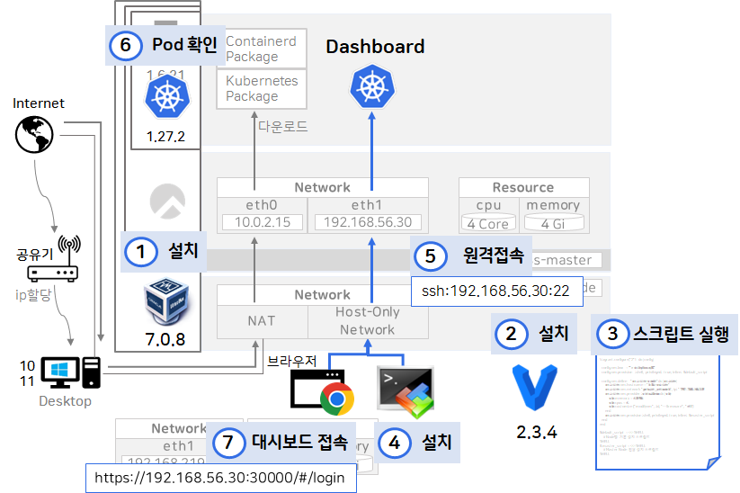
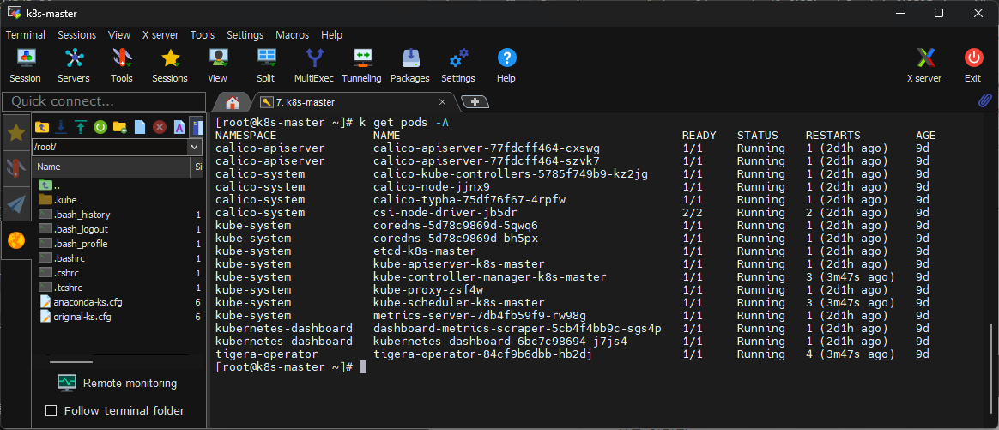
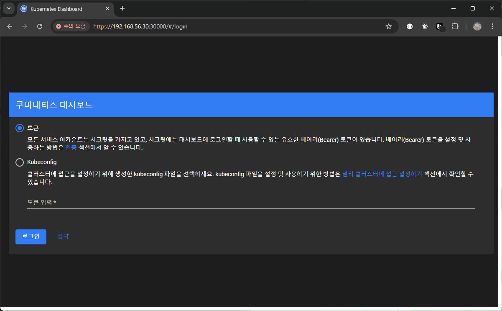
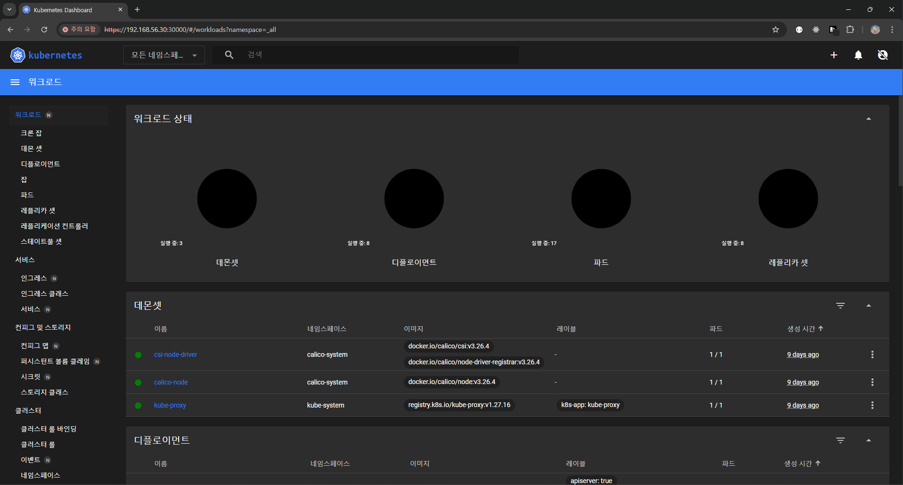

# 쿠버네티스 무게감 있게 설치하기 (ver. Windows)
> 개요
> 1. 로컬 PC에 VM 소프트웨어(VirtualBox) 설치 
> 2. Vagrant 설치 (IaC : Infrastructure as Code)
> 3. Vagrant 스크립트 다운, 실행
> 4. 로컬에서 SSH로 VM에 접속, 쿠버네티스 명령어로 생성된 pod 확인
> 5. 로컬 PC에서 대시보드 접속  
> [그림 요약]
> 

## 1. 로컬 PC에 VM 소프트웨어(VirtualBox) 설치
    Oracle VirtualBox 설치 >> https://www.virtualbox.org/
  내 로컬 PC 위에서 동작하는 가상 머신을 추가하기 위해 설치하는 소프트웨어.   
  위 링크에서 다운받으면 됨.
  
## 2. Vagrant 설치 (IaC : Infrastructure as Code)
    Vagrant 설치 >> https://developer.hashicorp.com/vagrant/install?product_intent=vagrant
  Vagrant는 인프라 구조를 코드로 생성하는 도구.  
  Vagrant는 가상화 소프트웨어를 필요로함,   
  그래서 `(1)` 에서 오라클에서 제공하는 VirtualBox를 설치한 것
  
## 3. Vagrant 스크립트 다운, 실행
  - windows > cmd 실행, 디렉토리생성  
    `C:\Users\사용자> mkdir k8s && cd k8s`
  - curl 명령어로 vagrant 스크립트 다운로드  
    `curl -O https://raw.githubusercontent.com/k8s-1pro/install/main/ground/k8s-1.27/vagrant-2.3.4/Vagrantfile`
  - Rocky Linux 세팅  
    `curl -O https://raw.githubusercontent.com/k8s-1pro/install/main/ground/k8s-1.27/vagrant-2.3.4/rockylinux-repo.json`  
    `vagrant box add rockylinux-repo.json`
  - Vagrant disk 설정 플러그인 설치  
    `vagrant plugin install vagrant-vbguest vagrant-disksize`
  - Vagrant 실행 (VM생성)  
    `vagrant up`

## 4. 로컬에서 SSH로 VM에 접속, 쿠버네티스 명령어로 생성된 pod 확인
- ssh 계정 정보
  - private ip : 192.168.56.30 
  - id : root
  - password : vagrant
- 쿠버네티스 명령어로 생성된 pod 확인
  - `k get pods -A`

## 5. 로컬 PC에서 대시보드 접속
1. 브라우저에서 `https://192.168.56.30:30000/#/login` 로 접속  
  

2. 로그인 `생략` 클릭

  

3. 상단 gnb에서 `default` -> `모든 네임스페이스` 로 변경

  
설치 완료!

강의 : 쿠버네티스 어나더 클래스 (지상편) - Sprint 1, 2  
https://www.inflearn.com/course/%EC%BF%A0%EB%B2%84%EB%84%A4%ED%8B%B0%EC%8A%A4-%EC%96%B4%EB%82%98%EB%8D%94-%ED%81%B4%EB%9E%98%EC%8A%A4-%EC%A7%80%EC%83%81%ED%8E%B8-sprint1/dashboard