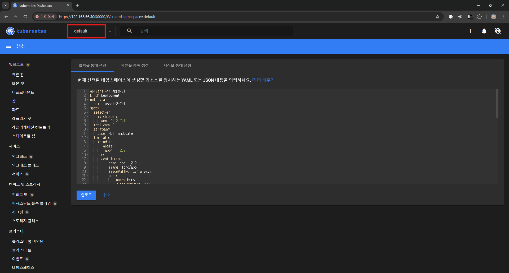
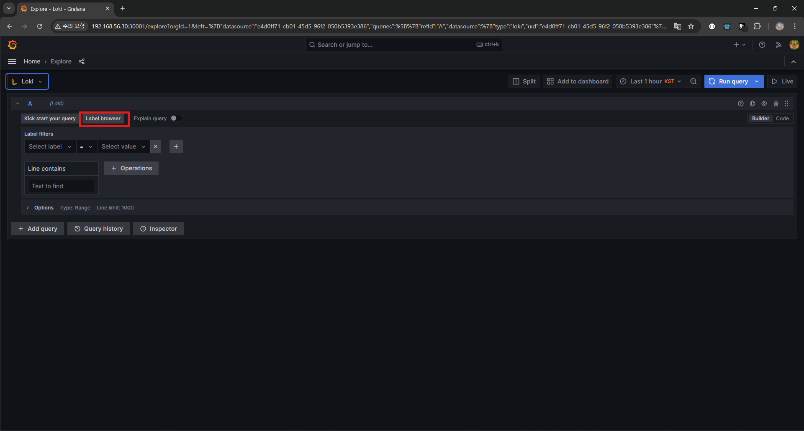

# 쿠버네티스가 편한 이유


- 개발 : 기존 App 개발 ~ 배포까지 사용되는 기술들
- 오케스트레이션/매니징 : 이 App을 MSA로 만들때 쓰이는 기술들
- 플랫폼/런타임 : 앱을 클라우드로 올릴때 주로 사용되는 기술들
- 프로비저닝/분석 : 실제프로젝트에 사용되는 기술들

## 1. 실제 프로젝트의 구조적 문제 (모니터링/로깅)
1. 개발과 모니터링 시스템이 서로 엮일 수 밖에 없는 구조.  
   - 성능 테스트시, 개발 기능에 성능이 안나오면 모니터링의 에이전트를 의심 
2. 개발에서는 한번도 사용되지 않은 모니터링 시스템을 만드는 구조
   - 개발 중에는 모니터링 시스템이 시기상 만들어지지 않아서 개발자 low 레벨로로그나 성능을 찾아서 사용해,  
   모니터링 시스템이 만들어져도 개발 관성땜에 사용하지 않게 됨
3. 오픈시 개발 프로젝트와 서로 다른 범위의 App들을 모니터링 하게 되는 구조
   - 초기 개발 계획과 달리 요구사항이 추가되거나 삭제되거나 모니터링 프로젝트가 먼저 끝나 없을 수 도 있음
> 쿠버네티스 생태계에 있는 로깅, 모니터링 툴을 사용하면 해결 가능
> 1. 개발 시스템과 엮이지 않음
> 2. 개발 초기부터 사용가능
> 3. 항상 App이 자동으로 반영되는 구조
---  

## 2. 모니터링 설치 (Loki-Stack)
Prometheus, Grafana 설치, Loki-Stack 연결 
1. 이전에 올려둔 쿠버네티스 VM ssh 접속
2. git 설치  
   ```shell
    yum -y install git
   ```
3. git 로컬 저장소 생성 및 이동
    ```shell
      git init monitoring
      git config --global init.defaultBranch main
      cd monitoring
    ```
4. git 원격 저장소 연결
    ```shell
    git remote add -f origin https://github.com/k8s-1pro/install.git
    ```
5. git checkout 설정
    ```shell
    git config core.sparseCheckout true
    echo "ground/k8s-1.27/prometheus-2.44.0" >> .git/info/sparse-checkout
    echo "ground/k8s-1.27/loki-stack-2.6.1" >> .git/info/sparse-checkout
    ```
6. git 원격저장소 받아옴
    ```shell
    git pull origin main
    ```
7. Prometheus,Grafana 설치
   - 설치
      ```shell
      kubectl apply --server-side -f ground/k8s-1.27/prometheus-2.44.0/manifests/setup
      kubectl wait --for condition=Established --all CustomResourceDefinition --namespace=monitoring
      kubectl apply -f ground/k8s-1.27/prometheus-2.44.0/manifests
      ```
   - 확인
     ```shell
      kubectl get pods -n monitoring
     ```
       
       
     (시간이 조금 걸림)
8. Loki-Stack 설치
   - 설치
     ```shell
      kubectl apply -f ground/k8s-1.27/loki-stack-2.6.1
      ```
   - 확인
     ```shell
     kubectl get pods -n loki-stack
     ```
     
     
9. Grafana 접속
    ```
   http://192.168.56.30:30001
   ```
   - `id` : admin
   - `pwd` : admin
   
10. Grafana에서 Loki-Stack 연결
    - 경로 : `Home > Connections > Connect data`
    - 검색어 : `loki`, 클릭
    - `Create a Loki data source` 클릭
    
    - 설정
      - http url값으로 `http://loki-stack.loki-stack:3100` 입력
        
      - 저장
          
  
    - 확인
      

    > ※ 삭제할려면 ※
    > ```shell
    > cd monitoring
    > #Prometheus 삭제
    > kubectl delete --ignore-not-found=true -f ground/k8s-1.27/prometheus-2.44.0/manifests -f ground/k8s-1.27/prometheus-2.44.0/manifests/setup
    > #Loki-stack 삭제
    > kubectl delete -f ground/k8s-1.27/loki-stack-2.6.1
    > ```
11. App 배포 환경 구성하기
  - 대시 보드 접속 후, default 에 yaml 파일 내용 추가후 업로드

  - 파드 확인

  - 그라파나로 가서 확인

  - namespace `default` 로 변경

  - 앞에서 추가해준 yaml 내용의 파드가 추가된 것을 확인가능


- 로그 보기 
  - `Home > Explore`이동
  - 좌측 상단에 select박스 클릭후 loki로 변경
  - `Lavel brower` 클릭 
  
  - 생성한 pod 클릭
  
  - 앞에서 yaml로 만들어준 스프링이 돌아가는 로그 확인 가능
  
---

## 3. 쿠버네티스 대표 기능 (Traffic Routing, Self-Healing, AutoScaling, RollingUpdate)
> 
- App에 지속적으로 트래픽 보내기
    ```shell
    while true; do curl http://192.168.56.30:31221/hostname; sleep 2; echo '';  done;
    ```
  - 호출받은 pod 이름이 출력됨
  
  - 고의적으로 pod를 삭제 
  
  - 삭제되거나 다운되어도 알아서 다시 생성하는 모습
  
  - 삭제되거나 다운되었을 때 한쪽만 트래픽을 받는 모습 
  

- App에 Memory Leak 나게 하기
  ```shell
  curl 192.168.56.30:31221/memory-leak
  ```
  - 재시작에 1이 됨
  
  - 그라파나에 해당 파드를 찾아가서 메모리 정보를 확인
  
  - 다시 `Loki-Stack`으로 가서 해당 시간의 로그정보를 확인
  - 

- App에 부하주기
  ```shell
  curl 192.168.56.30:31221/cpu-load
  ```
  - 기존

  - 부하후


- App에 이미지 업데이트
  ```shell
  kubectl set image -n default deployment/app-1-2-2-1 app-1-2-2-1=1pro/app-update
  ```
  - 기존
  
  - 이미지 업데이트 후
  - 
  - 트래픽 정상적으로 받음
  - 
  - 
- 기동하지 않는 App 업데이트
    ```shell
  kubectl set image -n default deployment/app-1-2-2-1 app-1-2-2-1=1pro/app-error
  ```
  
  
- 고의적으로 실행되지 못하게 해놓았기 때문에 계속 재실행됨,  
쿠버네티스가 app이 잘 기동이 되는지 확인하고 트래픽을 주는 것을 확인할 수 있음  
작업자 실수가 있어도 대처가능하게 해줌


- 업데이트 중지하고 롤백 할 경우
    ```shell
      kubectl rollout undo -n default deployment/app-1-2-2-1
    ```

### 배포한 Object 삭제
```shell
  kubectl delete -n default deploy app-1-2-2-1
  kubectl delete -n default svc app-1-2-2-1
  kubectl delete -n default hpa app-1-2-2-1
```

## 4. 이전 개발 인프라와 쿠버네티스로 편해진 
> [이전 서비스 개발시 환경 vs 쿠버네티스 환경]
>   
> 
> 성능 테스트 후, 특정부분에서 트래픽 부하정도를 보고 증설요청  
> 
> [이전]
> 1. vm담당자가 vm을 만들고 was, 개발언어 런타임, 네트워크, 저장소 설정등을 구축
> 2. 웹서버 담당자가 해당 App의 IP 설정  
>    (but 모니터링시스템과 연결하지 않았음으로 운영/관리자는 증설되었는지 확인불가)
> 3. 웹서버 담당자가 해당 App 로드밸런싱 및 기타 설정
> 4. 해당 VM을 모니터링 시스템에 연결  
> 
> [이후]
> 1. 쿠버네티스 담당자가 pod 층설, 끝.

### 인프라 환경을 코드로 확인,기록으로 관리
이전에는 어떤 포트를 열거나 어떤 환경을 변경했을 때 기록으로 남기기가 어려움  
쿠버네티스를 사용하면 VCS로 작업해 history나 인프라 내용을 확인가능, 이전 인프라환경을 복붙가능.
  


강의 : 쿠버네티스 어나더 클래스 (지상편) - Sprint 1, 2  
https://www.inflearn.com/course/%EC%BF%A0%EB%B2%84%EB%84%A4%ED%8B%B0%EC%8A%A4-%EC%96%B4%EB%82%98%EB%8D%94-%ED%81%B4%EB%9E%98%EC%8A%A4-%EC%A7%80%EC%83%81%ED%8E%B8-sprint1/dashboard