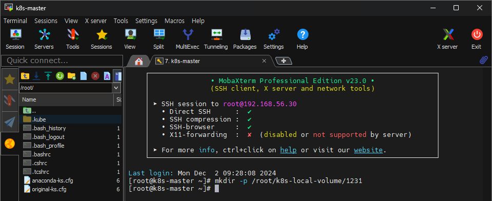
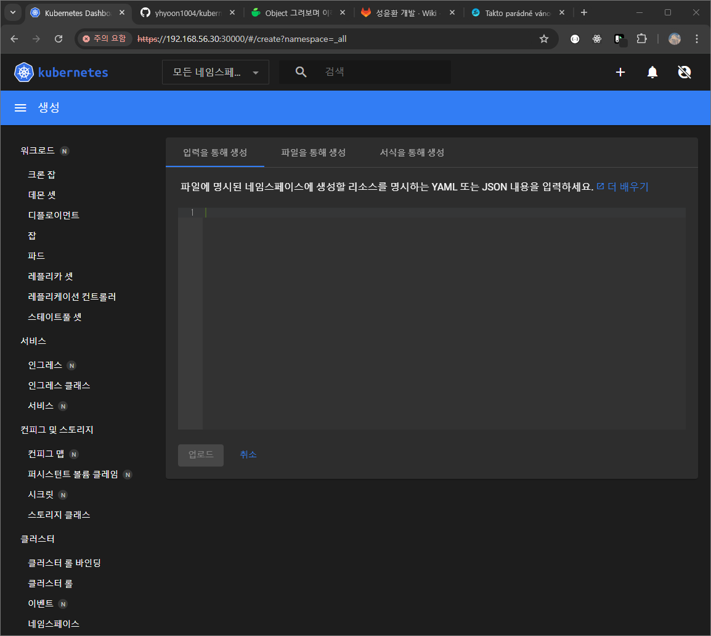
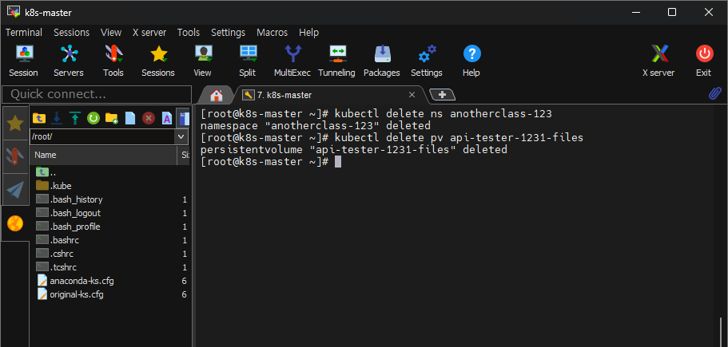

# Object로 이해하기
    1. kube 서버에 작업용 디렉토리 생성
    2. 쿠버네티스 대시보드에서 해당 Object 생성
    3. 작업했던 object들 삭제

Object도 컨텍스트같은 개념이 존재, 뎁스를 level 이라 칭하는 듯.  
최상위 컨텍스트는 Cluster
- Cluster
  - Namespace
  - PV
    - Deployment
    - Service


## 1. Kube 서버에 디렉토리 생성
  ```shell
    mkdir -p /root/k8s-local-volume/1231
  ```


## 2. Object 생성
   ```shell
   https://192.168.56.30:30000/#/create?namespace=_all
   ```
대쉬보드에 접속하여 아래 yaml 내용들을 각각 복사하여 업로드  



- Namespace : Object들을 그룹핑해주는 역할
  - namespace 삭제시 해당 namespace 안으 모든 object가 삭제됨
      ```yaml
      apiVersion: v1
      kind: Namespace
      metadata:
        name: anotherclass-123
        labels:
          part-of: k8s-anotherclass
          managed-by: dashboard
      ```
    ※한 namespace에는 이름이 중복되면 안됨, (정확히는 같은 종류의 object끼리 이름이 같으면 안됨)
    - metadata
      - name : 
      - label :


- Deployment : Pod를 만들고 업그레이드 해주는 역할
    ```yaml
    apiVersion: apps/v1
    kind: Deployment
    metadata:
      namespace: anotherclass-123 #위의 Namespace에서 만들었던 name을 적으면 해당 네임스페이스에 소속됨
      name: api-tester-1231  
      labels:
        part-of: k8s-anotherclass
        component: backend-server
        name: api-tester
        instance: api-tester-1231
        version: 1.0.0
        managed-by: dashboard
    spec:
      selector:
        matchLabels:
          part-of: k8s-anotherclass
          component: backend-server
          name: api-tester
          instance: api-tester-1231
      replicas: 2 #생성할 Pod의 개수
      strategy:
        type: RollingUpdate #Deployment의 핵심, 업데이트 방식
      template: #Pod 생성시 적용될 템플릿
        metadata:
          labels:
            part-of: k8s-anotherclass
            component: backend-server
            name: api-tester
            instance: api-tester-1231
            version: 1.0.0
        spec:
          nodeSelector: #Pod를 띄울 Node를 선택하는 속성
            kubernetes.io/hostname: k8s-master
          containers:
            - name: api-tester-1231
              image: 1pro/api-tester:v1.0.0 #dockerHub에 강사님이 올리신 이미지
              ports:
              - name: http
                containerPort: 8080
              envFrom:  #application에 사용될 환경변수 관련 속성
                - configMapRef: #해당 값을 제공해주는 역할 
                    name: api-tester-1231-properties
              startupProbe: #App이 기동됐는지 체크, [기동 X -> 재기동 | 기동 OK -> readinessProbe, livenessProbe 두개를 기동]
                httpGet:
                  path: "/startup"
                  port: 8080
                periodSeconds: 5
                failureThreshold: 36
              readinessProbe: #App에 트래픽을 연결할 건지 결정하는 속성
                httpGet:
                  path: "/readiness"
                  port: 8080
                periodSeconds: 10
                failureThreshold: 3
              livenessProbe:  #App이 정산이 아니면 재기동을 시킬건지 판단하는 속성
                httpGet:
                  path: "/liveness"
                  port: 8080
                periodSeconds: 10
                failureThreshold: 3
              resources:  #pod 하나에 cpu, memory 할당 정도를 지정하는 속성, 지정하지 않을 경우 노드의 모든 자원을 사용하게됨, 주의
                requests:
                  memory: "100Mi"
                  cpu: "100m"
                limits: #최대 사용량 설정
                  memory: "200Mi"
                  cpu: "200m"
              volumeMounts: 
                - name: files #volumes - name 과 매칭
                  mountPath: /usr/src/myapp/files/dev #pod 내부에 만들어지는 디렉토리
                - name: secret-datasource # 위의 files와 마찬가지로 등록됨
                  mountPath: /usr/src/myapp/datasource
          volumes:  #볼륨 생성 속성
            - name: files #볼륨이름
              persistentVolumeClaim:  #object
                claimName: api-tester-1231-files
            - name: secret-datasource
              secret:
                secretName: api-tester-1231-postgresql
    ```  
    
 - Service : Pod한테 트래픽을 연결시켜 주는 것
   ```yaml
    apiVersion: v1
    kind: Service
    metadata:
      namespace: anotherclass-123
      name: api-tester-1231
      labels:
        part-of: k8s-anotherclass
        component: backend-server
        name: api-tester
        instance: api-tester-1231
        version: 1.0.0
        managed-by: dashboard
    spec:
      selector:
        part-of: k8s-anotherclass
        component: backend-server
        name: api-tester
        instance: api-tester-1231
      ports:
        - port: 80
          targetPort: http
          nodePort: 31231
      type: NodePort
    ```
   
 - Configmap : pod에 환경변수 값을 제공하는 역할, Secret 
   ```yaml
    apiVersion: v1
    kind: ConfigMap
    metadata:
      namespace: anotherclass-123
      name: api-tester-1231-properties
      labels:
        part-of: k8s-anotherclass
        component: backend-server
        name: api-tester
        instance: api-tester-1231
        version: 1.0.0
        managed-by: dashboard
    data: #환경변수로 들어갈 값의 내용
      spring_profiles_active: "dev"
      application_role: "ALL"
      postgresql_filepath: "/usr/src/myapp/datasource/postgresql-info.yaml"
    ---
    apiVersion: v1
    kind: Secret
    metadata:
      namespace: anotherclass-123
      name: api-tester-1231-postgresql
      labels:
        part-of: k8s-anotherclass
        component: backend-server
        name: api-tester
        instance: api-tester-1231
        version: 1.0.0
        managed-by: dashboard
    stringData: #아래 값을 가지고 파일이 만들어짐
      postgresql-info.yaml: |
        driver-class-name: "org.postgresql.Driver"
        url: "jdbc:postgresql://postgresql:5431"
        username: "dev"
        password: "dev123"
   ```
   

- PVC(PersistentVolumeClaim), PV(PersistentVolume) : 
  ```yaml
  apiVersion: v1
  kind: PersistentVolumeClaim
  metadata:
    namespace: anotherclass-123
    name: api-tester-1231-files
    labels:
      part-of: k8s-anotherclass
      component: backend-server
      name: api-tester
      instance: api-tester-1231
      version: 1.0.0
      managed-by: kubectl
  spec:
    resources:
      requests:
        storage: 2G #저장공간을 얼마나 사용할지
    accessModes:
      - ReadWriteMany
    selector:
      matchLabels:
        part-of: k8s-anotherclass
        component: backend-server
        name: api-tester
        instance: api-tester-1231-files
  ---
  apiVersion: v1
  kind: PersistentVolume  #실제 volume을 지정하는 역할
  metadata:
    name: api-tester-1231-files
    labels:
      part-of: k8s-anotherclass
      component: backend-server
      name: api-tester
      instance: api-tester-1231-files
      version: 1.0.0
      managed-by: dashboard
  spec:
    capacity:
      storage: 2G
    volumeMode: Filesystem
    accessModes:
      - ReadWriteMany
    local:  #아래 path를 volume으로 사용하겠다라는 내용
      path: "/root/k8s-local-volume/1231"
    nodeAffinity: #마스터 노드 지정
      required:
        nodeSelectorTerms:
          - matchExpressions:
              - {key: kubernetes.io/hostname, operator: In, values: [k8s-master]}
  ```
  

- HPA : 부하에 따라 pod를 늘리거나 줄이는 스케일링 역할

  ```yaml
  apiVersion: autoscaling/v2
  kind: HorizontalPodAutoscaler
  metadata:
    namespace: anotherclass-123
    name: api-tester-1231-default
    labels:
      part-of: k8s-anotherclass
      component: backend-server
      name: api-tester
      instance: api-tester-1231
      version: 1.0.0
      managed-by: dashboard
  spec:
    scaleTargetRef:
      apiVersion: apps/v1
      kind: Deployment  #스케일링할 대상 지정
      name: api-tester-1231 
    minReplicas: 2  #최소 유지 pod 개수 
    maxReplicas: 4 #부하 발생시 최대 pod 개수
    metrics:
      - type: Resource
        resource:
          name: cpu
          target:
            type: Utilization
            averageUtilization: 60  #cpu 사용률이 평균 60%가 넘으면 스케일 아웃하도록 설정
    behavior: #스케일 아웃후, 동작 설정
      scaleUp:
        stabilizationWindowSeconds: 120 #pod 증설후, 2분동안 추가 증설 x
  ```
  

## 3. 실습 완료후, 작업했던 Namespace, PV 삭제
  ```shell
    kubectl delete ns anotherclass-123
    kubectl delete pv api-tester-1231-files
  ```
  


강의 : 쿠버네티스 어나더 클래스 (지상편) - Sprint 1, 2  
https://www.inflearn.com/course/%EC%BF%A0%EB%B2%84%EB%84%A4%ED%8B%B0%EC%8A%A4-%EC%96%B4%EB%82%98%EB%8D%94-%ED%81%B4%EB%9E%98%EC%8A%A4-%EC%A7%80%EC%83%81%ED%8E%B8-sprint1/dashboard