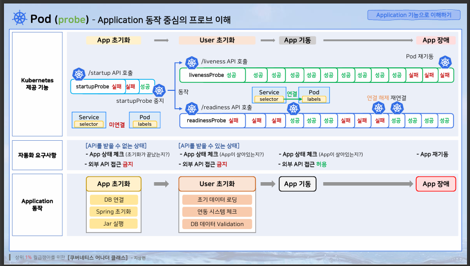
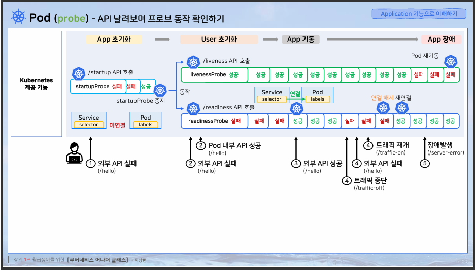
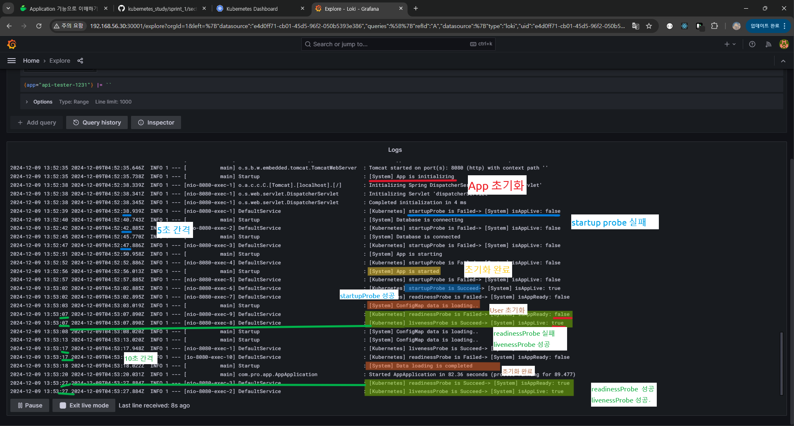

# Application 기능으로 이해하기 - Probe

- Probe 흐름

- 시점 별 
  - App 초기화 시점 : jar를 실행하고, spring 초기화, DB연결을 하는 단계  
  외부 API가 접근하지 못하게 하고 현재 상태를 알려주게 해야됨
  - User 초기화 시점 :  DB 데이터를 검증하고, 연동된 시스템 확인, 초기 데이터를 불러오는 단계  
  App의 현재 상태를 알려주고, 외부 API접근 못하게 설정
  - App 기동 

- HPA에서 pod 최대 파드 개수를 2개에서 1개로 변경

- 변경 이전

- 변경 후 pod를 1개로 맞추기 위해 pod하나가 죽는 것을 볼 수 있음

- 그라파나 접속

- live 버튼 클릭  
(실시간 로그가 보여짐)

- 기존 pod 제거

- 실시간 로그 확인
    
  1. app을 초기화 시작  
  app을 초기화 중 이니 해당 요청을 받지못해서 `false`가 발생  
  (이전부터 startupProbe가 동작하고 있음, 톰켓을 별도로 두고 하는 것이면 톰캣에 로그가 남음)
  2. 5초간격으로 `startupProbe`가 실행되고 있는 것이 로그로 보여짐
  3. app초기화가 완료된 후 `startupProbe` 가 `true`로 변경되고, `livenessProbe`도 `true`로 변경, 
  4. ConfigMap 정보, User를 초기화하는 것을 확인할 수 있음, `readinessProbe`는 사용자 초기화 구간에서 `false' 
  5. readinessProbe, livenessProbe 가 10초 간격으로 실행되는 것을 확인할 수 있고,`readinessProbe`는 `false`
  6. ConfigMap 데이터가 초기화 완료된후 `readinessProbe`가 `true`로 변경된 것을 확인