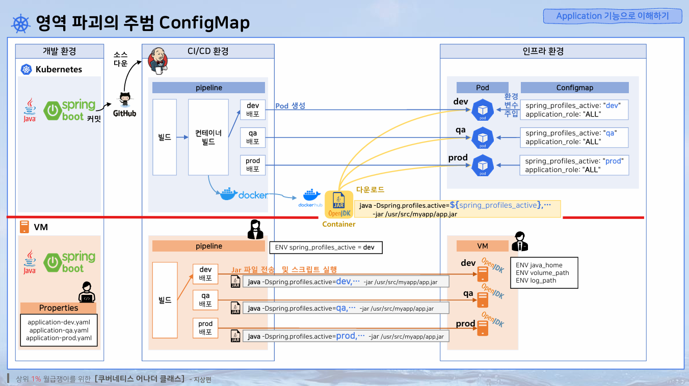

# Application 기능으로 이해하기 - Configmap, Secret

> 개요  
> 1.ConfigMap 확인하기  
> 2.Secret 확인  
> 3.컨테이너 내부 확인
> 4.API 정보 확인
> 5.ConfigMap 변경
> 6.Secret 변경
> 7.영역파괴의 주범 ConfigMap
> 8.이름 때문에 기대가 너무 컸던 Secret

---

## 1.ConfigMap 확인
- 대시보드에서 보기 
  
  
  

- 서버에서 보기  
  ```shell
  // Configmap 확인
  kubectl describe -n anotherclass-123 configmaps api-tester-1231-properties
  kubectl get -n anotherclass-123 configmaps api-tester-1231-properties -o yaml
  kubectl get -n anotherclass-123 configmaps api-tester-1231-properties -o jsonpath='{.data}'
  ```  
  
  
---
## 2. Secret 값 확인
- 대시보드에서 보기 (실제로는 base64로 인코딩되었지만 대시보드에서 디코딩해서 보여줌)
  
  
  

- 서버에서 보기
  ```shell
  // Secret 확인
  kubectl get -n anotherclass-123 secret api-tester-1231-postgresql -o yaml
  kubectl get -n anotherclass-123 secret api-tester-1231-postgresql -o jsonpath='{.data}'
  
  // Secret data에서 postgresql-info가 Key인 Value값만 조회 하기
  kubectl get -n anotherclass-123 secret api-tester-1231-postgresql -o jsonpath='{.data.postgresql-info\.yaml}'
  
  // Secret data에서 postgresql-info가 Key인 Value값을 Base64 디코딩해서 보기
  kubectl get -n anotherclass-123 secret api-tester-1231-postgresql -o jsonpath='{.data.postgresql-info\.yaml}' | base64 -d
  ```
    
  

---

## 3. 컨테이너 내부 확인
- 대시보드의 컨테이너 쉘에서 보기
  

- `env` 명령어로 `환경변수` 출력
    
  

- `secret` 출력
  ```shell
  // Secret 파일 확인
  ls /usr/src/myapp/datasource
  cat /usr/src/myapp/datasource/postgresql-info.yaml
  ```
  
  
  ```shell
  // java 실행 인자 확인
  jps -v
  ```
  


- kubectl에서 확인하는 법
  ```shell
  // 사용 포맷
  kubectl exec -n <namespace-name> -it <pod-name> -- <command>
  
  kubectl exec -n anotherclass-123 -it api-tester-1231-5c9f87b99c-4bdx6 -- env
  kubectl exec -n anotherclass-123 -it api-tester-1231-5c9f87b99c-4bdx6 -- cat /usr/src/myapp/datasource/postgresql-info.yaml
  kubectl exec -n anotherclass-123 -it api-tester-1231-5c9f87b99c-4bdx6 -- jps -v
  ```
---
  
## 4. API 정보 확인
- 브라우저에서 app에 http 호출로 정보확인  
`http://192.168.56.30:31231/info`  
  
`http://192.168.56.30:31231/info`  


---
## 5. ConfigMap 변경
- 대시보드에서 접속
  
  

- `application_role` 을 `ALL`에서 `GET`으로 변경

- Pod에 들어가서 환경변수를 보면 기존 값이 그대로 있는 것을 확인 가능  
(환경변수는 Pod 생성때 주입됨, 그러므로 아래와 같이 변경되지 않는게 **`정상`** )

- 콘솔에서 직접 변경 (하지만 app 실행시에 초기 환경변수 값으로 들어가서 효과없음)
  ```shell
  export application_role=GET
  ```
  
---
## 6. Secret 변경
- 대시보드에서 변경
  - 일반 편집은 인코딩되서 변경이 힘듬
    
    
  - 시크릿 상세보기를 클릭하여 편집   
    `dev` -> `test`, `dev123` -> `test123`
    
    
  - `test`로 변경되었는 지 확인하기
    ```shell
    cat /usr/src/myapp/datasource/postgresql-info.yaml
    ```
    
    


`환경변수로 주입` or `볼륨으로 연결` 하느냐에 따라 실시간으로 app의 값을 반영할 수 있고 없고에 영향

---

## 7. 영역파괴의 주범 ConfigMap
>
- 쿠버네티스 환경에서의 동작
  - `인프라 환경`
    1. DockerHub 에서  같은 이미지를 받음
    2. 해당 이미지로 개발, QA, 운영 등 환경에 맞게 다른 값을 주기위해 `ConfigMap`을 만들어서 제공시킴
  - `개발 환경`
    1. `springboot`로 개발하고 커밋
    2. `github`에 반영된 소스를 `Jenkins`가 해당 소스를 받아서 `파이프라인` 동작
  - `파이프라인`
    1. 빌드 > 컨테이너 빌드 > dev 배포 > pod 생성

- 쿠버네티스가 아닌 환경의 경우
  - `개발환경` 쿠버네티스와 동일
  - `인프라 환경`
    1. 인프라 담당자가 VM을 생성하거나 서버를 추가
    2. `springboot` 실행환경에 맞게 추가해준 `VM/서버` 위에 `JDK`를 설치
    3. 요구하는 서비스 환경에 맞게`(개발/QA/운영)` 각각의 `VM/서버` `환경변수(JAVA_HOME 등등..)`를 설정  
  - `파이프라인`
    1. 빌드 > `VM/서버`에 `jar(컴파일된 소스)`파일을 전송 > jar 파일에 환경에 맞는 환경변수를 넣어 실행 
  - `영역별 담당자들이 관리하는 변수`
    - `인프라` : 시스템 환경변수
    - `devOps`: 소스 실행 명령에 사용되는 옵션 변수
    - `개발자` : application.properties 와 같은 옵션별 소스 변수
  > 이와 같이 각 `담당자 별로 다루는 변수`들이 있고  
  > `쿠버네티스` `configmap`으로 관리하니 
  > 각 담당자 별로 `각자의 영역을 침범한다고 생각`할수도 있고,   
  > `변수값을 결정하기 위해 조율하는 과정`과 이로인해 영역이 넘나들수 있고  
  > `정답이 없어`서 영역 파괴의 주범이다

---

## 8. 이름 때문에 기대가 너무 컸던 Secret
- Secret 
  - `type` 속성(기본 = opaque) {암호화를 지원해주진 않음}  
    - `opaque`값 : 투명이라는 의미로 `ConfigMap`처럼 사용가능
    - `docker-registry` 값 : `private docker registry(개인용 dockerhub)`에서 이미지를 가져올때 사용  
    `docker-username , docker-password , docker-email , ..` 등의 데이터 값이 들어가야됨
    - `tls` 값 : Pod 마다 각각 다른 보안인증서를 넣을 때 사용
    -  `...`
- Secret 중요 데이터 암호화 방안
  1. Secret 에 대한 Object 생성을  파이프라인에 태워서 만들지 말고  
     쿠버네티스 클러스터 내에서 직접 만들고 관리    
     kubernetes 권한을 철저히 적용하면   
     타인의 Secret 을 조회하고 Pod에 들어가볼 수 없음
  2. 특정 key 값을 통해 데이터 문자를 암호화하고  
    오직 해당 app 안에서 해당 암호화된 문자를 복호화 해줄수 있는 로직처리  
     (이런 방식이면 configmap을 사용해도 ok)
  3. 암호화 관리 서드파티 도구를 사용 (HashiCorp- `Vault`)  
  관리자에 한해 개인id/pwd록 `Vault`에 접속 후, app에서 사용할 비밀번호 입력 
  app이 기동하면서 `Vault`에 비밀번호 요청, 관리자가 지정한 pod에만 값을 주도록 세팅
