# 손쉽게 데브옵스 환경을 구축하는 방법
>1. 실습환경으로 세팅된 vagrant 파일 다운로드
>2. Jenkins 초기세팅
>3. JDK, Gradle 설정
>4. DockerHub 가입 및 사용 설정
>5. MasterNode 연동 설정
>6. 빌드/배포 jenkins 아이템 생성


---

## 1. 실습환경으로 세팅된 vagrant 파일 다운로드

```shell
  #vagrant 파일 다운로드
  curl -O https://raw.githubusercontent.com/k8s-1pro/install/main/ground/cicd-server/vagrant-2.3.4/Vagrantfile
  
  #로키 리눅스 설정 json을 다운
  curl -O https://raw.githubusercontent.com/k8s-1pro/install/main/ground/cicd-server/vagrant-2.3.4/rockylinux-repo.json
  
  #다운로드한 로키 리눅스 json을 vagrant box에 추가함
  vagrant box add rockylinux-repo.json
  
  # vagrant에 플러그인 설치 (vagrant-vbguest, vagrant-disksize)
  vagrant plugin install vagrant-vbguest vagrant-disksize
  
  #해당 vagrant파일 실행
  vagrant up
```

---

## 2. Jenkins 초기 세팅
```shell
    # jenkins 초기 패스워드 발급
    sudo cat /var/lib/jenkins/secrets/initialAdminPassword
    
```
- 젠킨슨 접속  
`http://192.168.56.20:8080/login`
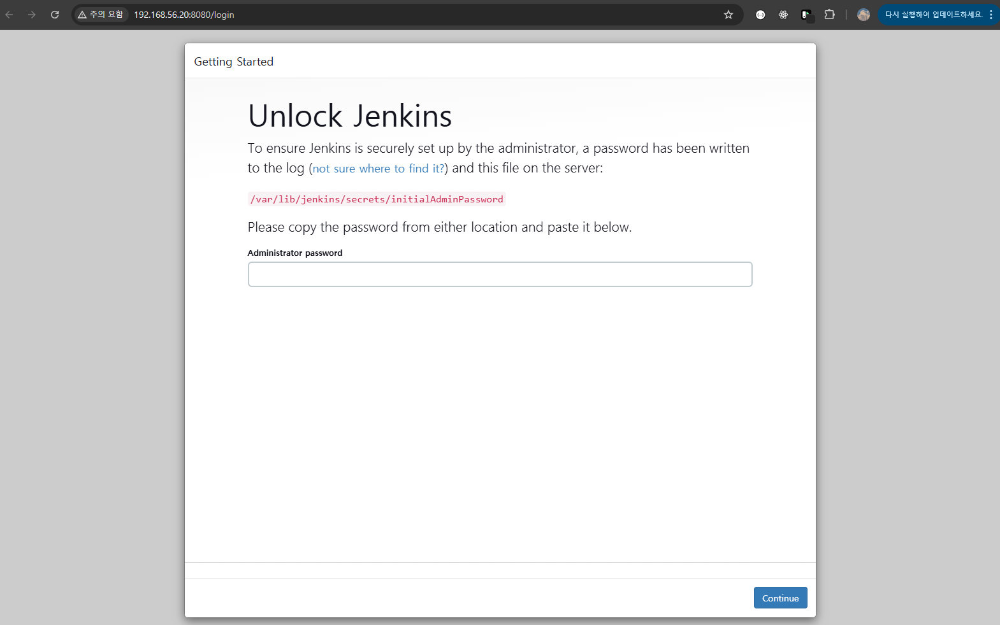
- 발급 받은 패스워드 입력
- Install suggested plugins 클릭
  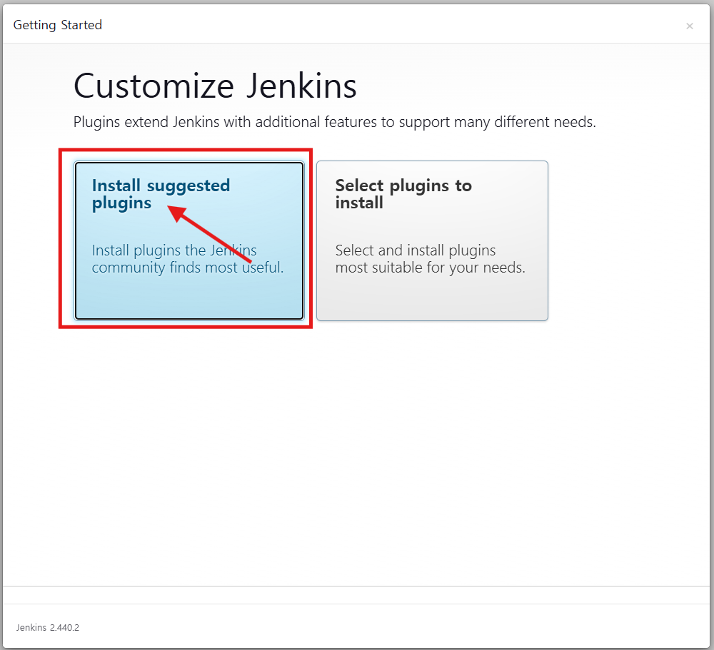

---

## 3. JDK, Gradle 설정
- 아래 사진의 표시대로 이동
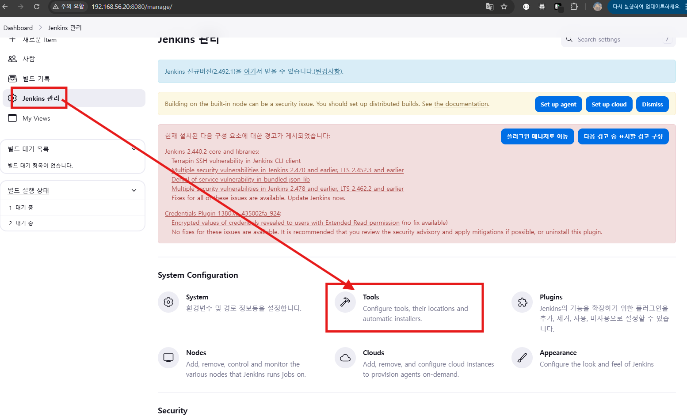
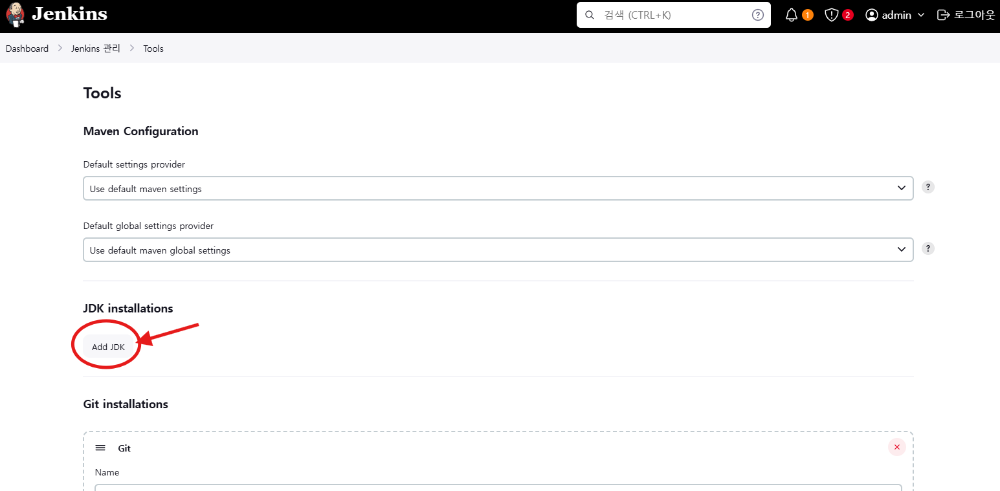
- JDK 설정
  - `Name`은 `jdk-17`, `JAVA_HOME`은  아래 명령어 실행 후 나오는 경로를 입력  
  `sudo find / -name java | grep java-17-openjdk`
  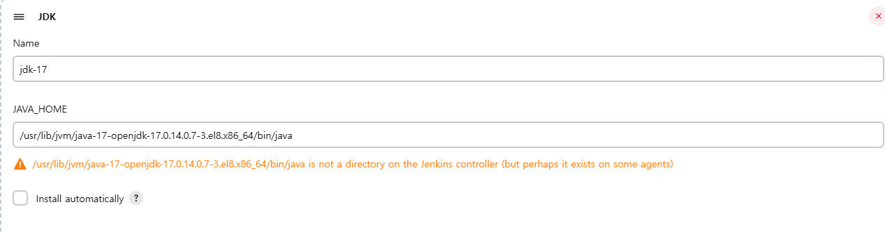
- Gradle 설정
  - `Name`은 `gradle-7.6.1`
  - `Install automatically` 체크 해제후  
  쉘에서 `sudo echo $GRADLE_HOME` 입력후 나오는 경로 입력 후 저장  
  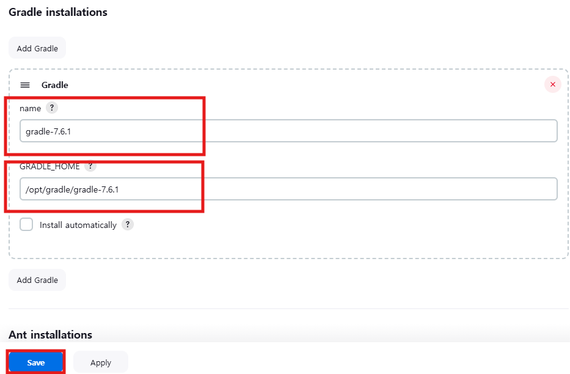

---

## 4. DockerHub 가입 및 사용 설정
dockerHub 가입이 안되어있으면 가입 후, 쉘에 접속
- Jenkins가 Docker를 사용할 수 있게 권한 부여
    ```shell
      #도커소켓에 접근할 수 있게 권한 변경
      chmod 666 /var/run/docker.sock
      #도커 그룹에 jenkins 추가
      usermod -aG docker jenkins
    ```
- Jenkins 계정으로 로그인
    ```shell
      su - jenkins -s /bin/bash    
    ```
- 서버에서 Jenkins 계정으로 로그인 후 docker 로그인 
    ```shell
      docker login
    ```
  
---

## 5. MasterNode 연동 설정
1. 폴더 생성
```shell
    mkdir ~/.kube
```
2. sprint1의 마스터 노드에서 인증서 복사해오기
```shell
  scp root@192.168.56.30:/root/.kube/config ~/.kube/
```
3. 동작 확인
```shell
kubectl get pods -A
```
4. 실습 소스 코드 포크
- `https://github.com/k8s-1pro/kubernetes-anotherclass-sprint2/tree/main/2121`
- image 필드에 `1pro`를 내 도커 이름으로 변경

5. GitHub

## 6. 빌드 배포 아이템 스크립트 작성 및 실행
1. 프로젝트 소스 빌드 아이템 생성  
  - 아이템 생성  
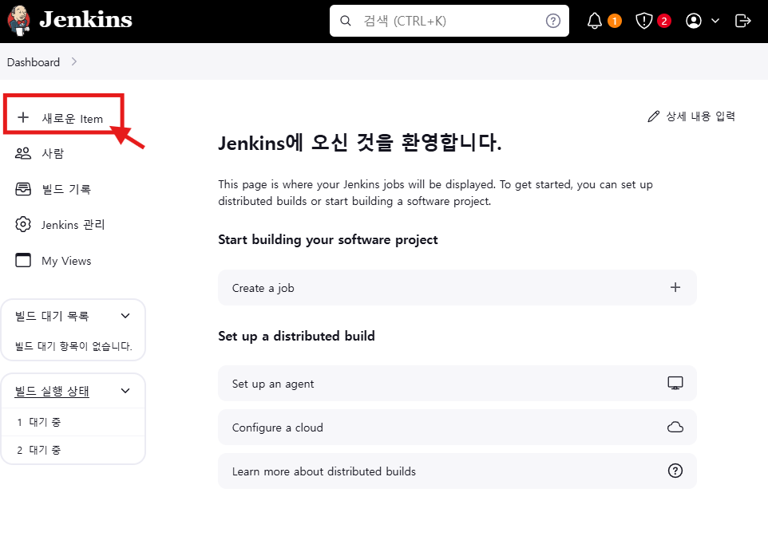
   - 이름을 `2121-source-build`으로 작성후, freestyle project 클릭 후 저장  
  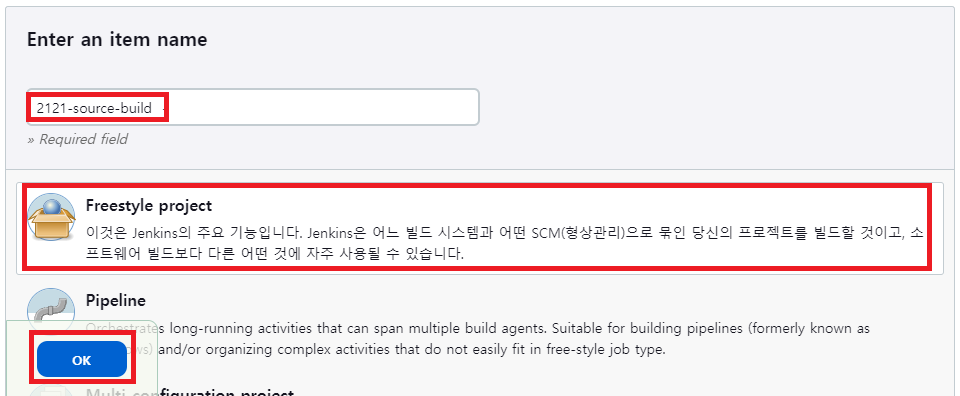
   - GitHub project 체크 후, 아래 url로 project url 입력  
   `https://github.com/k8s-1pro/kubernetes-anotherclass-api-tester/`  
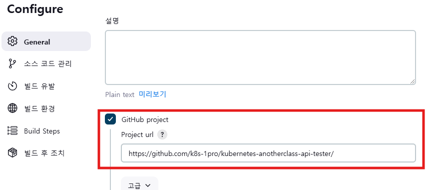
   - 소스관리 탭 설정
     - none > git 변경
     - RepositoryURL 아래 url로 설정  
       `https://github.com/k8s-1pro/kubernetes-anotherclass-api-tester.git`
     - branch master > main 변경
     - 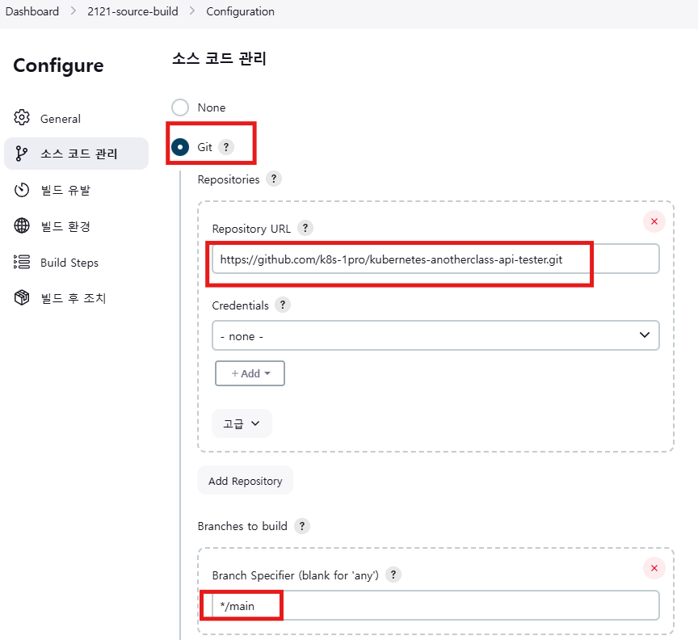
   - 빌드 설정 
     - `Add build step` 클릭 >`Invoke Gradle script` 선택
     - gradle  버전 선택
     - Task 에 `clean build` 입력
   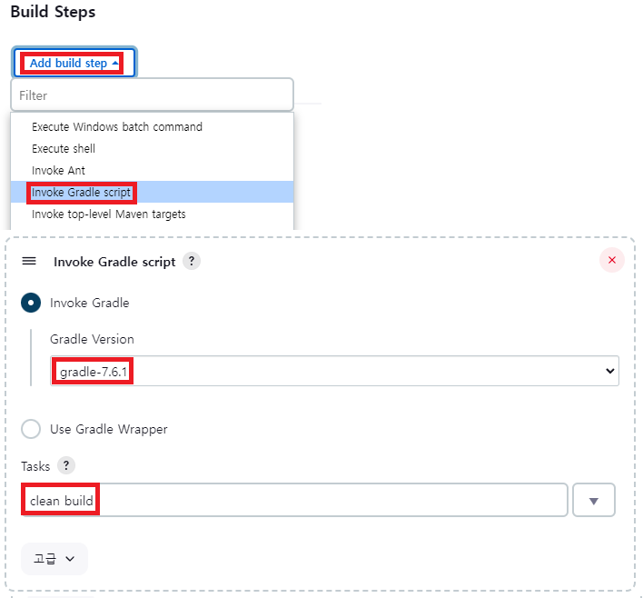
   - 저장  

  - 만들어준 아이템에 들어가 `지금 빌드` 클릭 
  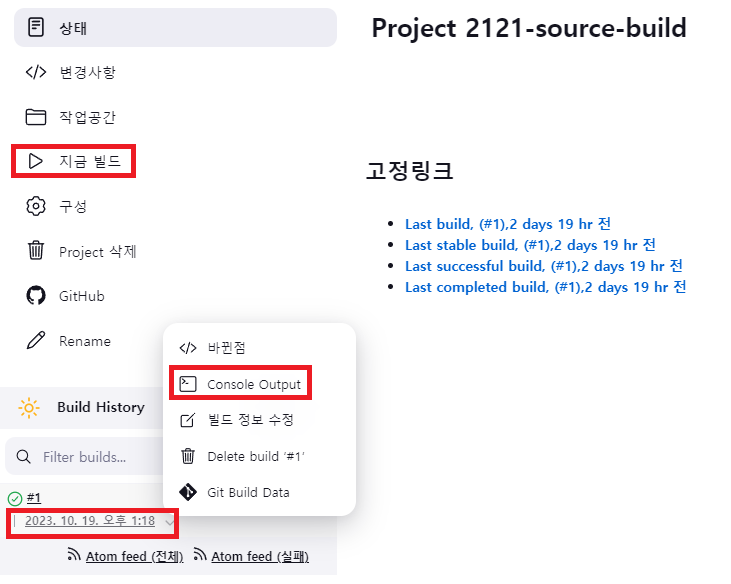
  - 서버에 접속해 해당 소스가 빌드된 파일 확인
    ```shell
    ls /var/lib/jenkins/workspace/2121-source-build/build/libs
    ```
---   

2. 도커 컨테이너 빌드 아이템 생성 
- 아이템 생성  
  
- 이름을 `2121-container-build`으로 작성후, freestyle project 클릭 후 저장  
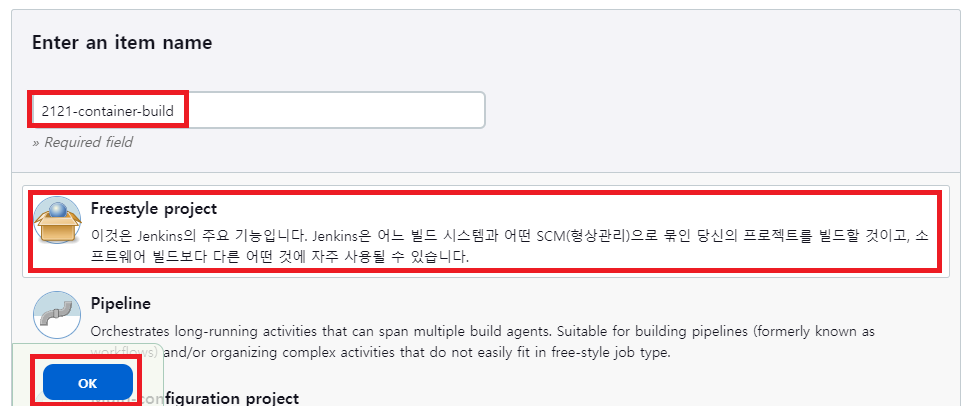
- GitHub project 체크  
`https://github.com/yhyoon1004/kubernetes-anotherclass-sprint2/`
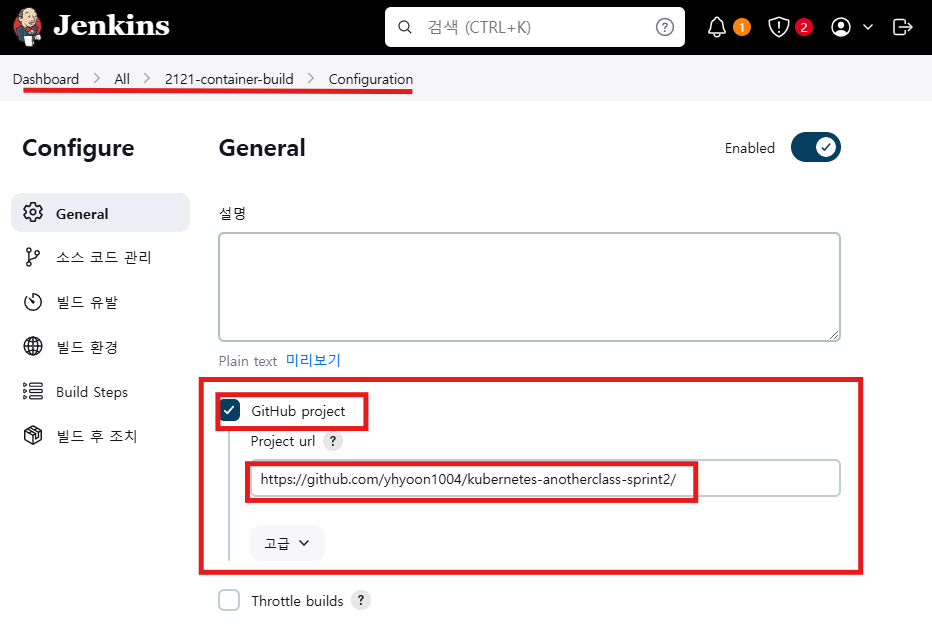
- 소스 관리 설정
  - none > git 변경
  - RepositoryURL 설정  
  - branch master > main 변경
  `https://github.com/yhyoon1004/kubernetes-anotherclass-sprint2.git`
  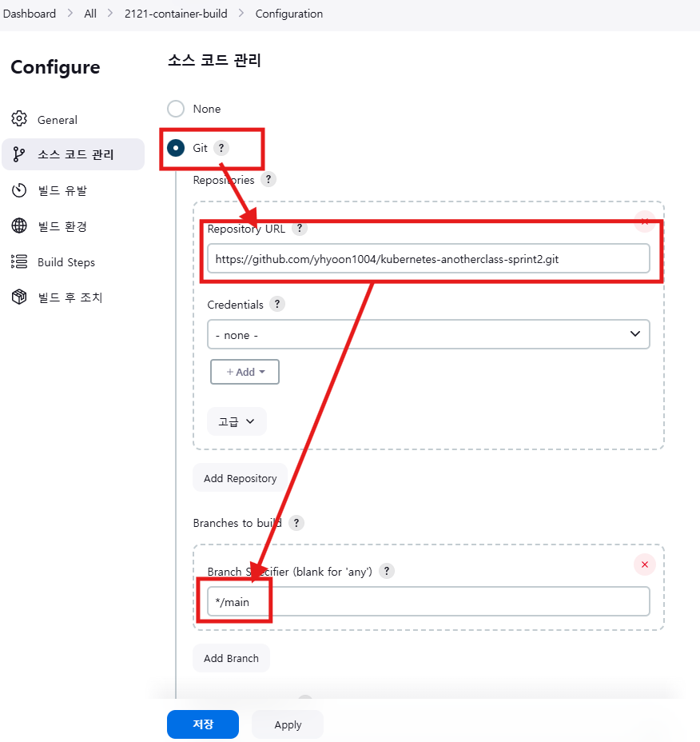
- github 레포지토리에서 특정 경로만 다운받게 설정
  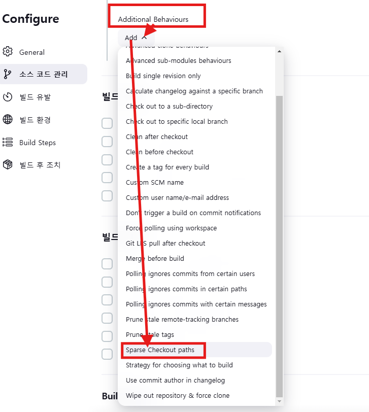
  - 새로 생긴 탭의 path에 `2121/build/docker` 입력
  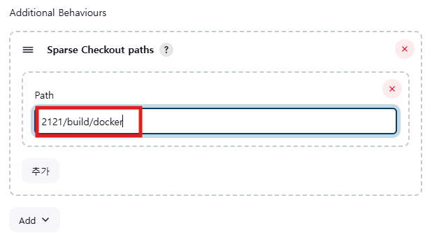
- 빌드 스텝에 `Execute shell` 클릭  
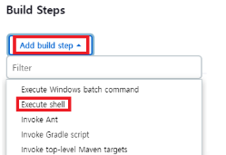
  - 커맨드 탭에 아래 스크립트 복사
  ```shell
  # jar 파일 복사
  cp /var/lib/jenkins/workspace/2121-source-build/build/libs/app-0.0.1-SNAPSHOT.jar ./2121/build/docker/app-0.0.1-SNAPSHOT.jar
  
  # 도커 빌드
  docker build -t yunhwansung/api-tester:v1.0.0 ./2121/build/docker
  docker push yunhwansung/api-tester:v1.0.0
  ```
  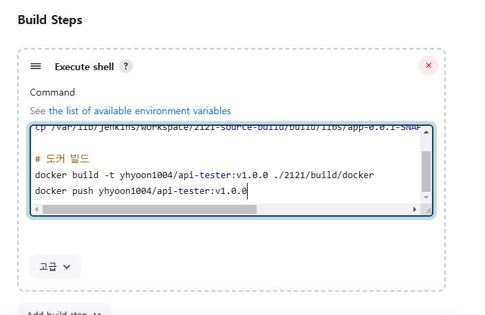
- 만들어준 아이템에 들어가 `지금 빌드` 클릭
  
- 서버에서 생성된 dockerfile 내용 확인
  ```shell
    cat /var/lib/jenkins/workspace/2121-container-build/2121/build/docker/Dockerfile
  ```
- 내 docker hub 레포지토리에 만들어진 이미지 확인  
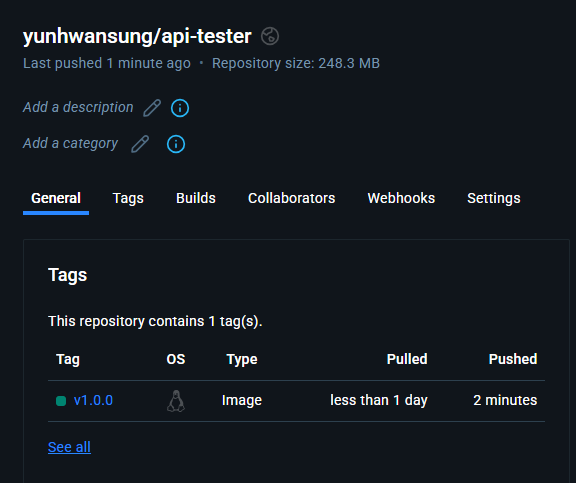
---

3. 빌드/배포 jenkins 아이템 생성
- 아이템 생성  
  
- 이번에는 기존 컨테이너 빌드 아이템을 복사 해옴  
  `2121-deploy`로 네이밍
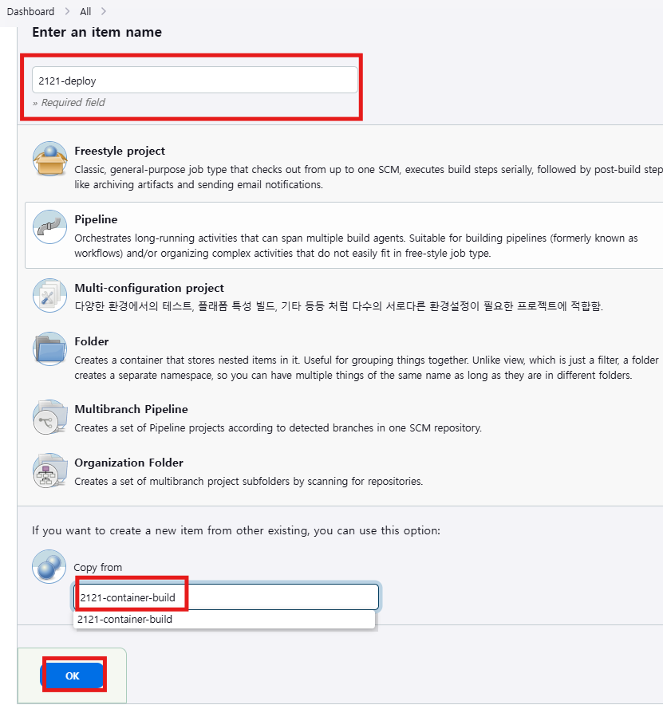
- 생성한 아이템에 설정에서 git에서 다운받는 경로를 아래 경로로 변경  
`2121/deploy/k8s`  
  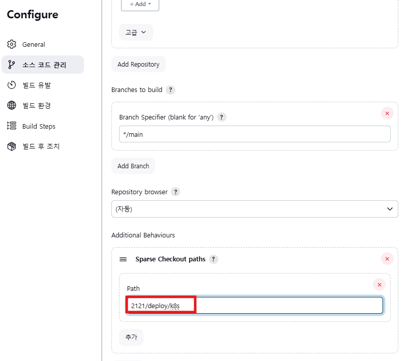
- `Execute shell`부분 내용을 아래 스크립트로 변경
  ```shell
  kubectl apply -f ./2121/deploy/k8s/namespace.yaml
  kubectl apply -f ./2121/deploy/k8s/pv.yaml
  kubectl apply -f ./2121/deploy/k8s/pvc.yaml
  kubectl apply -f ./2121/deploy/k8s/configmap.yaml
  kubectl apply -f ./2121/deploy/k8s/secret.yaml
  kubectl apply -f ./2121/deploy/k8s/service.yaml
  kubectl apply -f ./2121/deploy/k8s/hpa.yaml
  kubectl apply -f ./2121/deploy/k8s/deployment.yaml
  ```  
  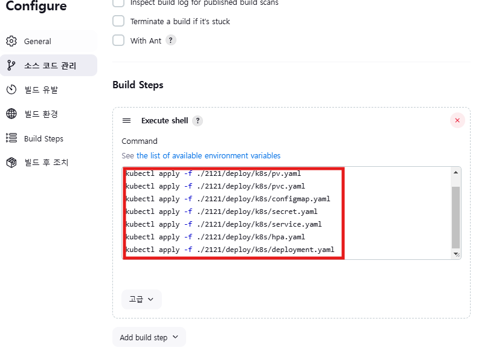
- 저장 후 빌드
- 내 마스터 노드의 대쉬보드 접속해 pod, configMap, 등등 생성된것을 확인  
  `https://192.168.56.30:30000/`